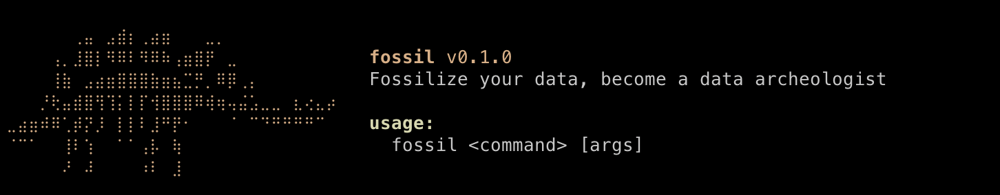

# fossil



I built fossil around one idea: a packed file should be able to tell you how it was
made. While it compresses, it writes down what it did, and `fossil explain` reads it
back.

## Install

You'll need [Rust](https://rustup.rs). Then install straight from the repo:

```sh
cargo install --git https://github.com/punctuations/fossil
```

This works on macOS, Linux, and Windows. From a clone, `./install.sh` (or
`cargo install --path .`) does the same, and `cargo build --release` leaves the
binary in `target/release`.

## Usage

```sh
fossil pack <input> [output]      # compress a file or directory → .fossil (no input packs the clipboard)
fossil lift                       # fossilize the clipboard, then copy the .fossil back
fossil unpack <file.fossil> [out] # restore the original (verifies CRC)
fossil inspect <file>             # per-block analysis: entropy, model, savings
fossil map <file>                 # entropy heatmap, or block models for a .fossil
fossil explain <file.fossil>      # the reconstruction recipe (--block N for one block)
```

Flags: `pack --lossy[=bits]` drops the low bits of each byte for a smaller file;
`--best-effort` packs already-compressed inputs losslessly instead of refusing, and
`--images-only` limits lossy to raw images. `pack --verify` round-trips before writing,
and `unpack --trust` skips the CRC check.

## Completions and man page

Shell completions are in `completions/` and a man page in `man/`.

```sh
source completions/fossil.bash                              # bash
cp completions/fossil.zsh ~/.zfunc/_fossil                  # zsh (on your fpath)
cp completions/fossil.fish ~/.config/fish/completions/      # fish
sudo cp man/fossil.1 /usr/local/share/man/man1/             # then: man fossil
```

## How it works

fossil cuts a file into 4 KB blocks and runs a handful of small models on each one,
keeping whichever output comes out smallest. The choice is written into the file, so
`fossil explain` can read it back block by block.

The models so far: RAW, RLE, Huffman, LZ, LZ+Huffman, BWT+MTF+range, adaptive range,
order-1 PPM, a generator for ramps and constant fills, a delta filter, CSV transpose,
and a word dictionary. Tiny or random files are stored as-is so they never grow, every
file carries a CRC32 so corruption shows up on unpack, and packing a directory makes
one LZ pass over the whole thing so duplicate files cost almost nothing.

Run `fossil help` for the full command list.
