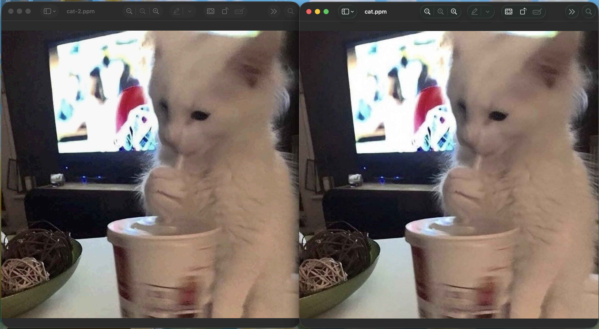

# examples

A handful of files to run fossil on. Pack one, then look at it:

```sh
fossil pack examples/mixed.bin out
fossil map out.fossil          # which model handled each block
fossil explain out.fossil      # the block-by-block recipe
```

## the files

| file | what it is | packs to |
|---|---|---|
| `mixed.bin` | synthetic, 88 blocks, a different kind of data every few blocks | ~78% smaller |
| `bigmix.bin` | same idea but bigger (220 blocks) for a busier map | ~78% smaller |
| `cat.ppm`, `cat-2.ppm` | a raw 800x770 image, uncompressed RGB (Netpbm P6) | ~73% smaller |
| `cat.jpg` | already a JPEG | ~0%, a touch larger |
| `z` | 100 KB of zeros | 99.8% smaller |

`mixed.bin` and `bigmix.bin` are built so different stretches want different models, so `fossil map` draws a colorful grid. Across them you'll see RAW, RLE, LZ, LZR, BWTM, RANGE, GEN, DELTA, and WORD. A few models (PPM, CSV, LZH, ENTROPY) don't show up because they lost the contest on this data. A model only lands in the map when it produced the smallest block for some chunk, so a short legend just means a handful of models won everything.

`cat.ppm` compresses well even losslessly because fossil runs a Paeth predictor over raw images first, replacing each pixel with the small difference from its neighbors before the models ever see it. It's also the one to try `--lossy` on (see below). `cat.jpg` is here to show what happens when there's nothing left to squeeze.

## ... Larger?

No compressor can shrink every possible input. That's the pigeonhole principle: if a file is random, or already compressed, there's no structure left to exploit, and you can't beat storing it as-is.

fossil also wraps every output in a small container: a magic number, a version byte, the original extension, a CRC32, and the per-block framing. That's a fixed cost of a few bytes. So a tiny file, or one that won't compress, comes out a little larger, and the message tells you how much of it is header:

```
60055 → 60073 bytes  0.0% larger
60055 raw bytes + 18 bytes of header
```

When a block won't compress, fossil stores it with the RAW model rather than bloating it further, so the only growth is that header. `cat.jpg` is the example: it's already compressed, so every block is stored raw and the file grows by exactly the header.

## Lossy

`pack --lossy[=bits]` trades a little detail for a smaller file. It quantizes the input by zeroing the low `bits` of every byte (3 by default), throwing away the part you're least likely to notice and leaving longer runs and fewer distinct values for the models to chew on.

`cat.ppm` goes from 73% smaller (lossless) to 88% smaller with `--lossy=3`:



```sh
fossil pack --lossy=3 examples/cat-2.ppm out
```

It only applies to raw, uncompressed bytes (a PPM image, plain data, that sort of thing). fossil refuses it on anything already compressed (PNG, JPEG, GIF, ZIP, gzip, or another `.fossil`):

```
JPEG is already compressed. --best-effort packs it lossless (why?)
```

Two reasons for that refusal:

- There's nothing cheap to throw away. A compressed file already sits near its entropy floor, so clearing low bits won't make it smaller, it just damages it.
- It breaks the file. Most of these formats checksum their own contents (PNG CRCs every chunk, gzip and ZIP carry a CRC32 of the data), so zeroing low bits trips those checksums and a viewer treats the file as corrupt and refuses to open it. The ones without a checksum (JPEG, GIF) are entropy-coded streams, so flipping bits desyncs the decoder into garbage instead of a slightly worse image. Either way you get a broken file, not a smaller one.
